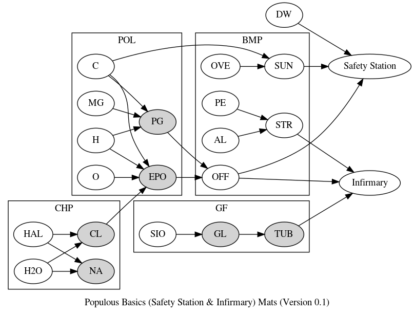
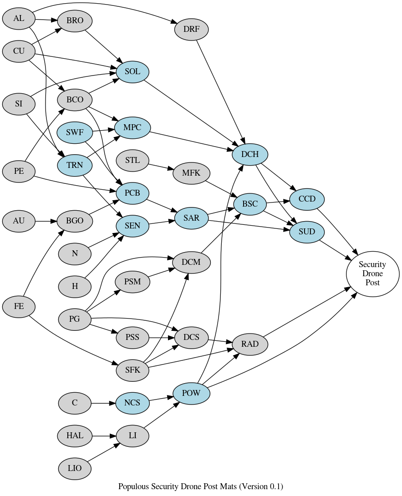
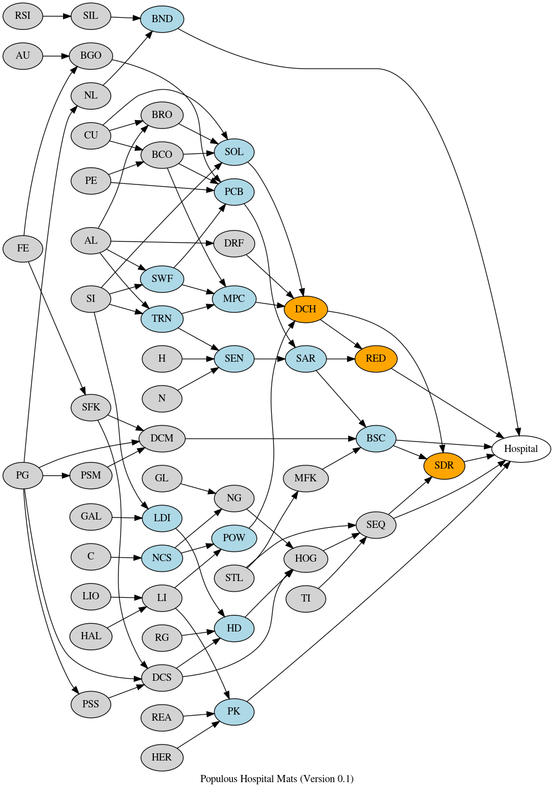

Various graphs of materials for upkeep of Populous Infrastructure
=================================================================

Interesting notes: Infrastructure seems to be split into two tiers, low end:
Safety Station, Infirmary, etc (stuff that provides small effect), and high end
which requires engineers, and provides large bonus. I'm willing to bet its also
more efficient use of materials in the end.

Security Drone Post and hospital provide larger boosts but require Engineers:

